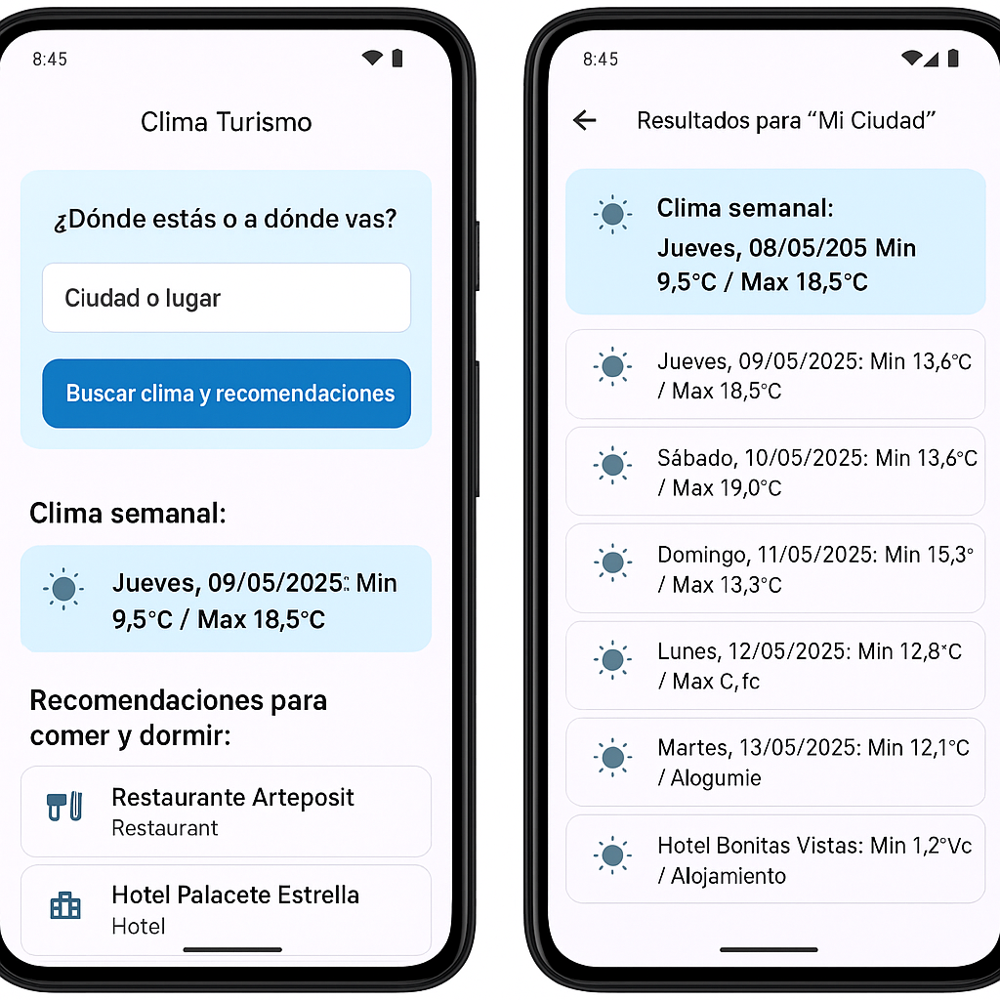

# Clima Turismo

Una aplicación Flutter que permite al usuario consultar el clima semanal de cualquier ciudad del mundo y obtener recomendaciones cercanas de lugares para comer y dormir, usando geolocalización.

---

## 🚀 Funcionalidades principales

### 🔍 Búsqueda por ubicación
- El usuario ingresa una ciudad o destino.
- Se obtiene su latitud y longitud mediante la API de Open-Meteo.

### ☀️ Pronóstico del tiempo
- Se muestra el clima de los próximos días.
- Incluye temperaturas mínimas y máximas diarias.
- Se representa el estado del clima con íconos y descripciones (despejado, nublado, lluvia, etc.).
- El día actual se resalta visualmente.

### 🍴 Recomendaciones locales
- Basado en las coordenadas del lugar, se consulta la API de Foursquare.
- Se muestran lugares para comer (restaurantes) y dormir (alojamientos).
- Cada recomendación incluye su categoría.
- Al pulsar el icono del mapa, se abre Google Maps con la ubicación.

---

## 🧱 Tecnologías usadas

- **Flutter** (interfaz móvil)
- **Provider** (gestión de estado)
- **HTTP** (peticiones a API REST)
- **Open-Meteo API** (clima y geocodificación)
- **Foursquare Places API** (recomendaciones locales)
- **Google Maps** (visualización de ubicaciones)

---

## 🧭 Capturas de pantalla

| Clima semanal | Recomendaciones |
|---------------|------------------|
|  |  |
|  |  |

*(Asegúrate de colocar las imágenes en `assets/screens/` y declarar la carpeta en `pubspec.yaml`)*

---

## 📦 Instalación y ejecución

1. Clona el repositorio:
```bash
git clone https://github.com/gestionarlaweb/2025-ClimaTurismo.git
cd clima_turismo
```

2. Instala las dependencias:
```bash
flutter pub get
```

3. Ejecuta la aplicación:
```bash
flutter run
```

---

## 📌 Notas adicionales
- La aplicación utiliza claves públicas, pero pueden externalizarse en un archivo `.env` si se desea.
- Se puede instalar como PWA en iOS o Android desde el navegador.

---

## 🧩 Futuras mejoras

- Soporte para varios idiomas.
- Guardar historial de búsquedas.
- Modo oscuro.
- Integración con servicios de reservas de hoteles.
- Mostrar más detalles del clima (humedad, viento, etc.).

---

## 📄 Licencia
MIT License.
